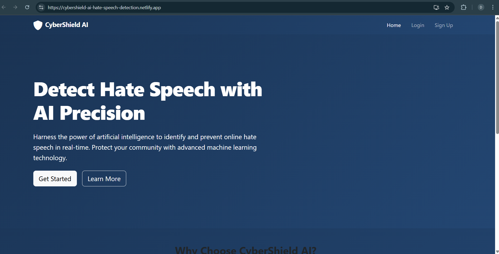
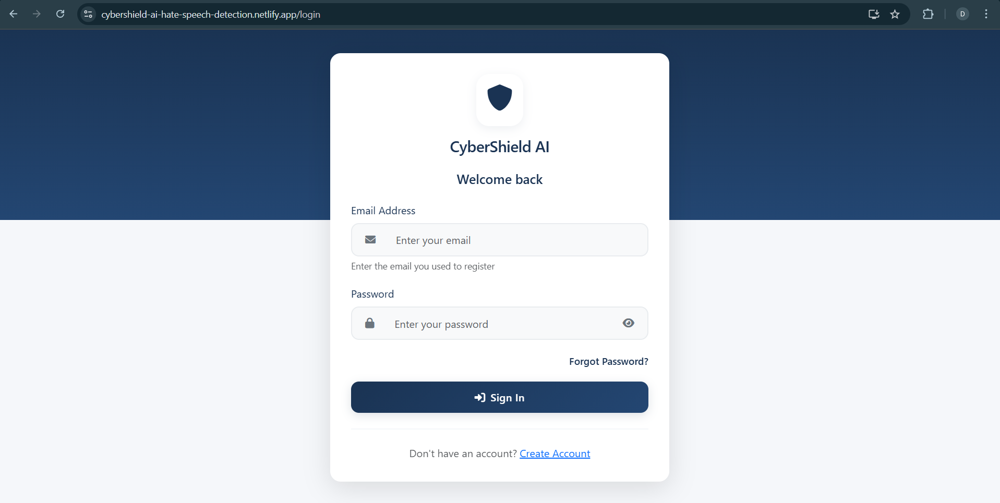
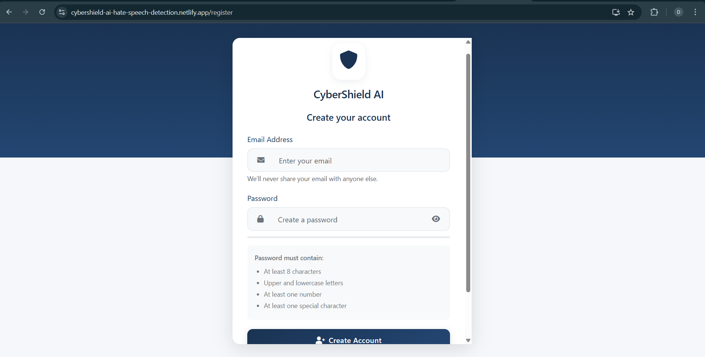
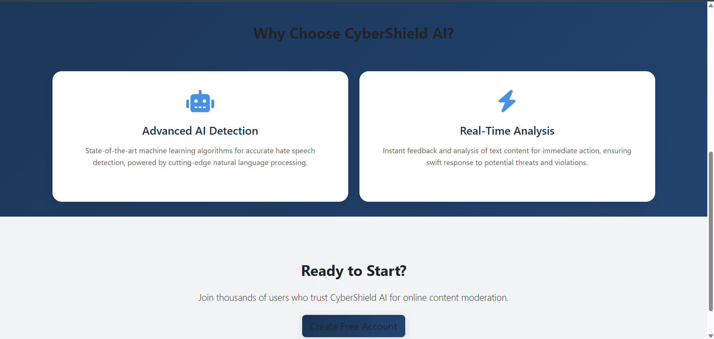
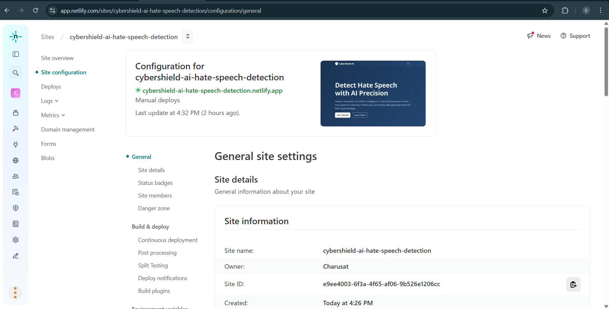

# CyberShield AI - Live Hosting

## Frontend Deployment

The CyberShield AI application frontend is successfully deployed and accessible online.

### Deployment Details
- **Platform**: Netlify
- **URL**: [https://cybershield-ai-hate-speech-detection.netlify.app/](https://cybershield-ai-hate-speech-detection.netlify.app/)
- **Deployment Date**: March 27, 2025

### Features Available in Deployed Frontend
- Complete user interface demonstration
- Responsive design across devices
- Authentication screens and forms
- Dashboard layouts and components
- Security analysis visualization

### Deployment Process
The application was deployed using Netlify's static site hosting:
1. React application built using 
pm run build
2. Production build uploaded to Netlify
3. Site configured with automatic HTTPS
4. Global CDN distribution for fast access

### Future Integration Plans
In future development phases, we plan to:
- Deploy the backend API with FastAPI
- Configure MongoDB Atlas for cloud database
- Integrate the machine learning model for cyberbullying detection
- Connect the frontend to the backend via API

### Documentation
- The deployment satisfies the project requirement for "Live hosting of the application"
- The frontend demonstrates the application's interface and user experience

### Screenshots

#### Home Page

#### Login Screen

#### Registration Page

#### About Page

#### Hosting Configuration

