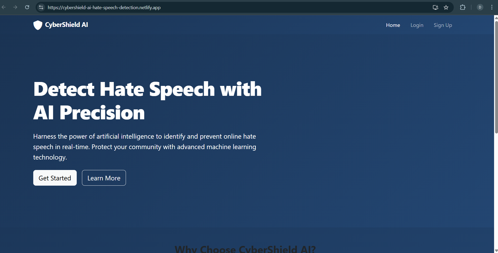
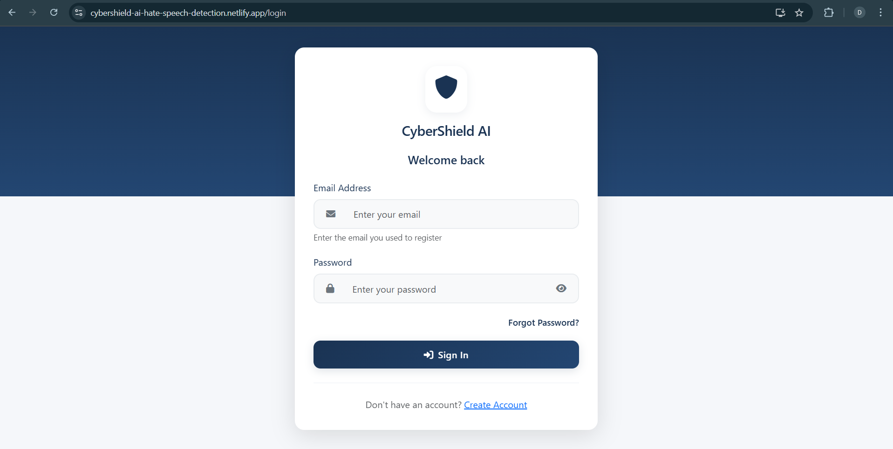

# CyberShield AI

## Project Overview
CyberShield AI is an AI-powered cyberbullying detection and prevention system designed to create safer online spaces by identifying and mitigating harmful content.

## Live Deployment
The application is deployed and accessible at:
[https://cybershield-ai-hate-speech-detection.netlify.app/](https://cybershield-ai-hate-speech-detection.netlify.app/)

## Key Features
- User authentication with email and phone verification
- Enhanced security validation for all inputs
- Password strength requirements and evaluation
- Firebase integration for secure phone verification
- **HTTPS Implementation** with self-signed certificates
- **Comprehensive Testing** with Jest and Python unittest
- **Backup and Recovery** system for data protection
- **Live Hosting** on Netlify for public access
- MongoDB for data persistence
- Docker containerization for easy deployment

## Technology Stack
- **Frontend**: React.js for responsive user interface
- **Backend**: FastAPI (Python) for API endpoints and security
- **Database**: MongoDB for scalable data storage
- **Infrastructure**: Docker and Docker Compose for containerization
- **Authentication**: Email/password with bcrypt and Firebase phone verification
- **Testing**: Jest for frontend and Python unittest for backend

## Security Features

### Registration System
- **Email Validation**: Enforces valid email formats and domain verification
- **Password Strength Requirements**:
  - Minimum 8 characters length
  - Must include uppercase and lowercase letters
  - Must include at least one number
  - Must include special characters
  - Real-time strength indicator
- **Two-Factor Authentication**: Optional phone verification via Firebase


### Content Analysis
- **Real-time Analysis**: Content is analyzed as it's entered
- **Threat Detection**: Multi-level classification of potential cyberbullying content
- **Content Filtering**: Options to filter or flag potentially harmful messages
- **User Reporting**: System for reporting problematic content for review

## Screenshots

### Home Page


### About Page


### Registration Page
Features include:
- Email format validation
- Password strength meter
- Secure form submission
- Field validation feedback


### Login Screen
Features include:
- Credential validation
- Error feedback for incorrect credentials
- Forgot password recovery option



### Content Analysis Dashboard
Features include:
- Real-time content scanning
- Severity classification


## Getting Started

### Prerequisites
- Docker and Docker Compose
- Git

### Installation
1. Clone the repository
   ```bash
   git clone https://github.com/Parekh-Dev/CyberShieldAI-22IT086-22IT094.git
   cd CyberShieldAI-22IT086-22IT094